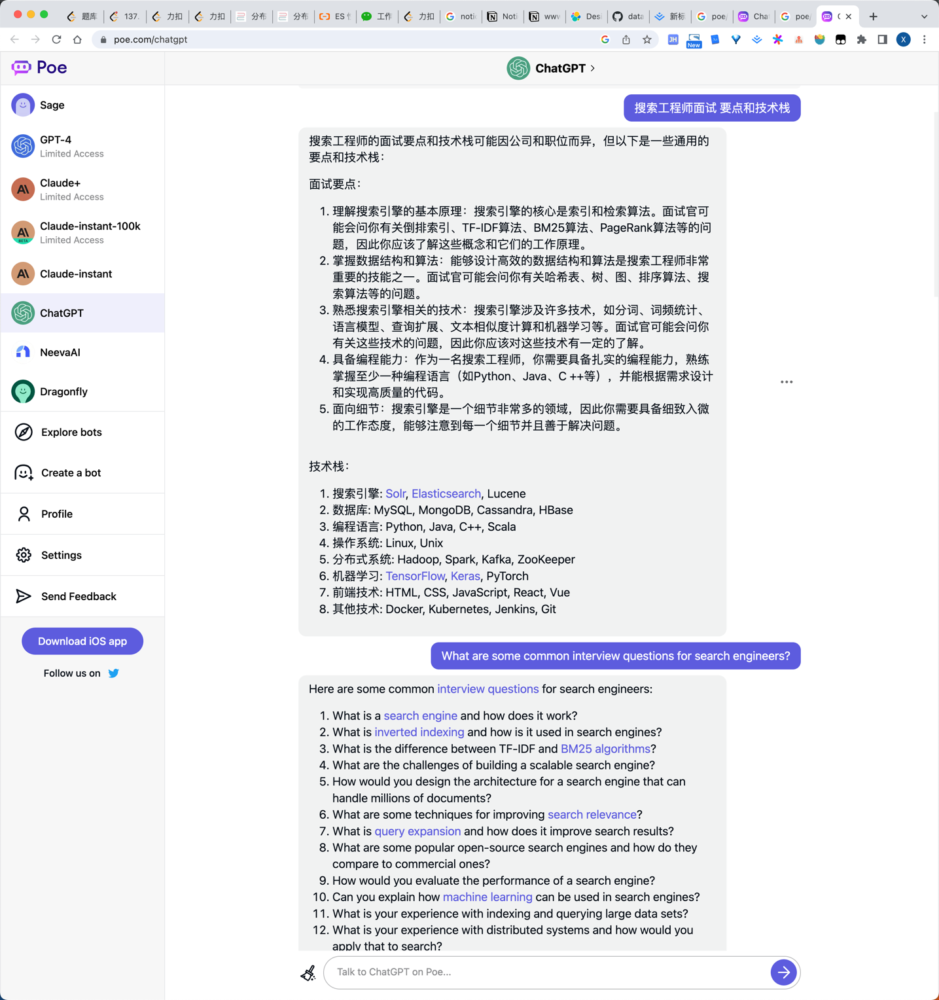

# red growing with search 

## search tech

### storage
__storage in es__
* 几个重要的概念:
* DICT:
    + 如果内存无法容下字典: __文件系统缓存__(IO开销); 字典分片: 
* TF: term frequency
* DM25:
* IDF:
* PageRank:
* Shared:
  * 每一个分片都是一个lucene索引:
### online

### HA

